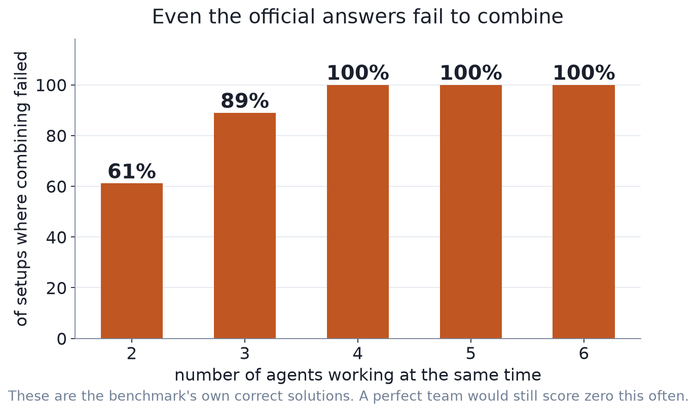
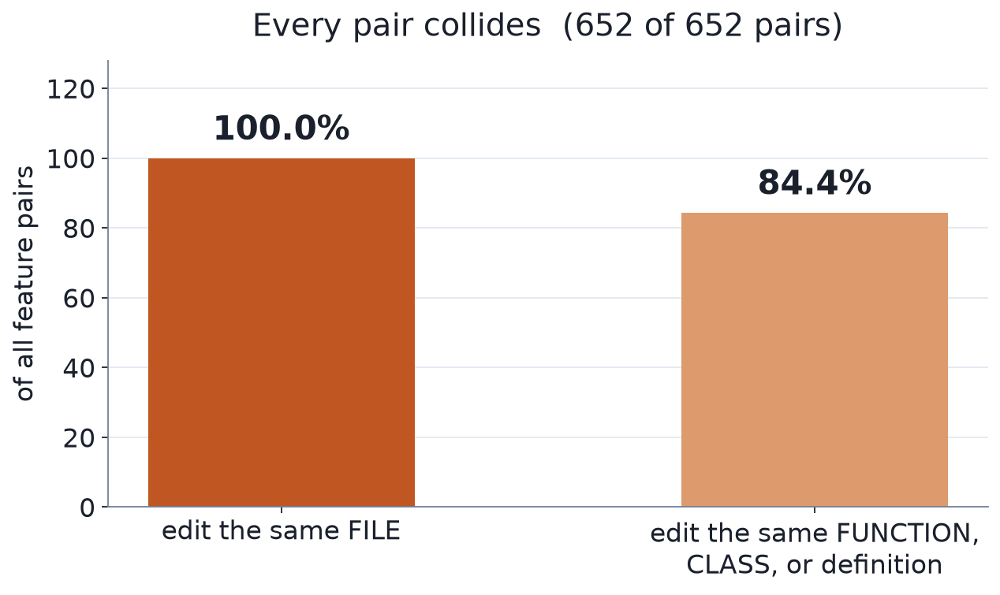
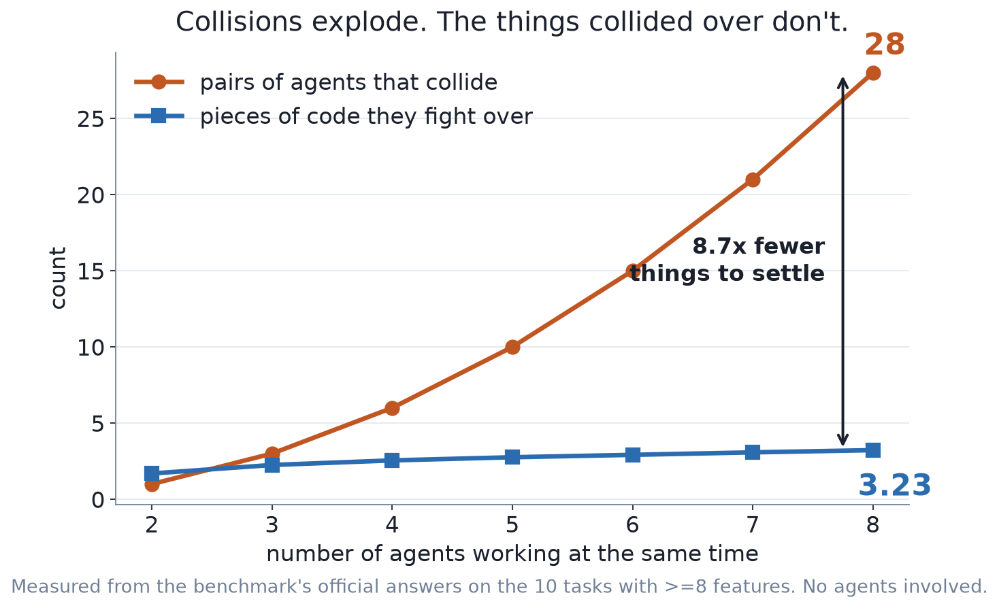
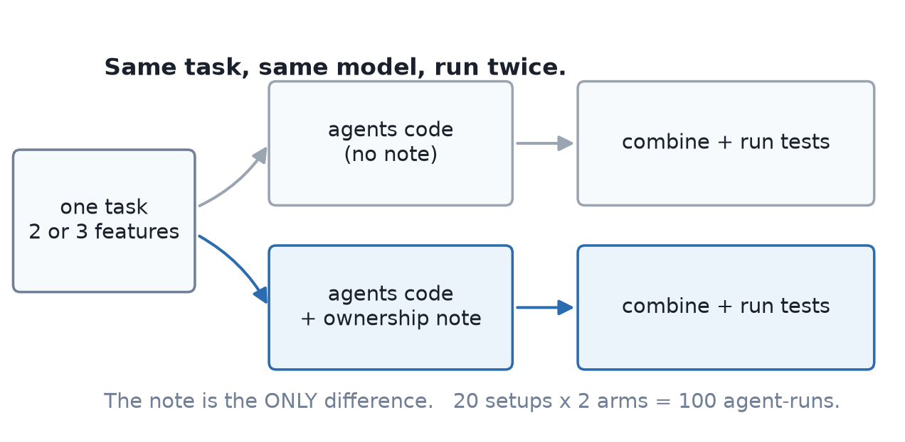
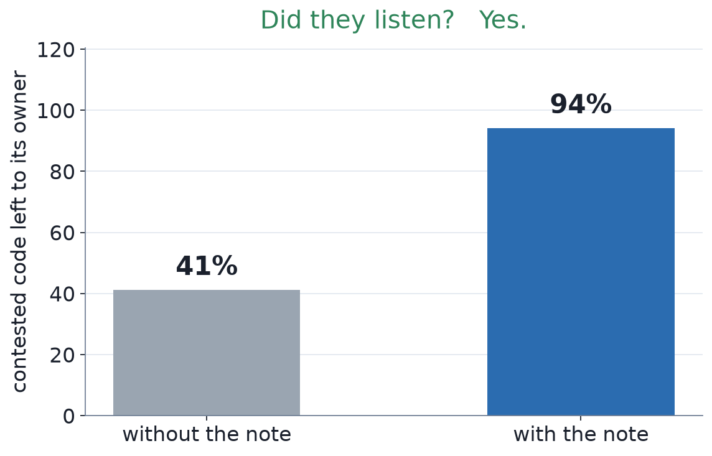
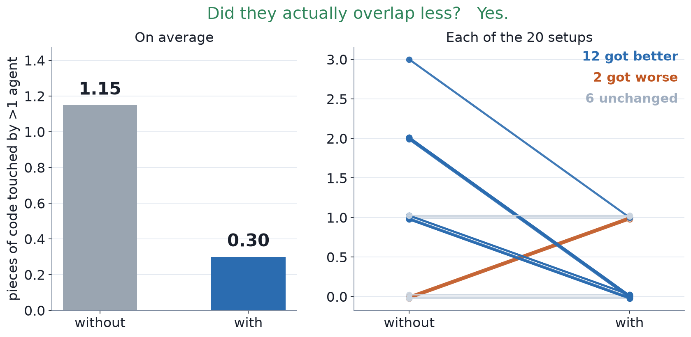
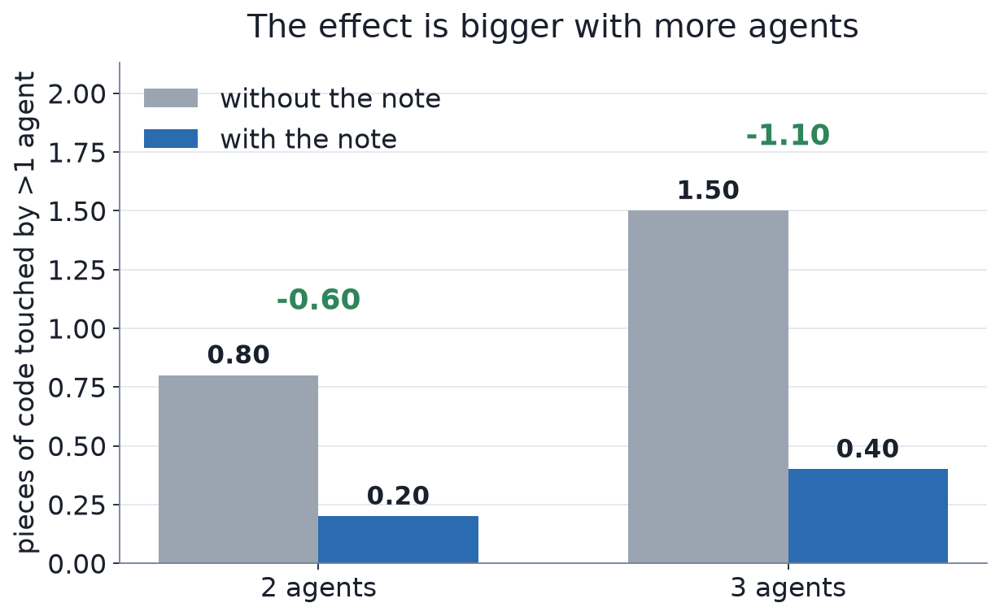
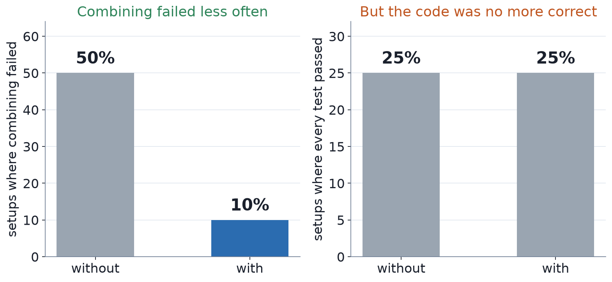
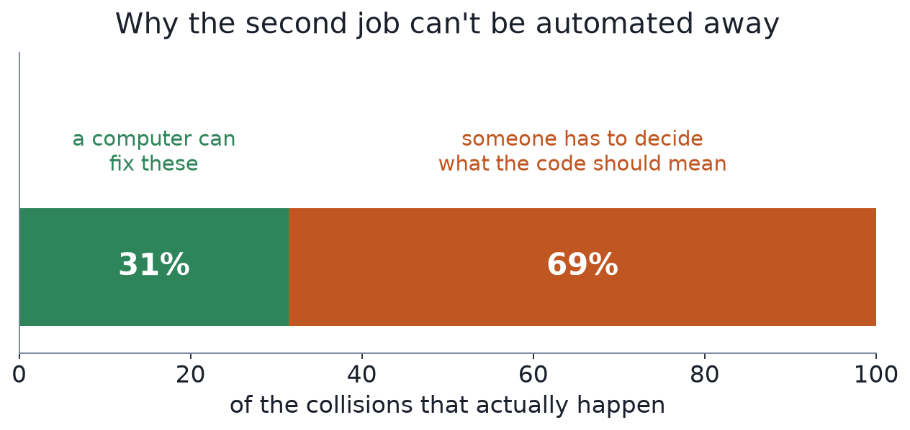
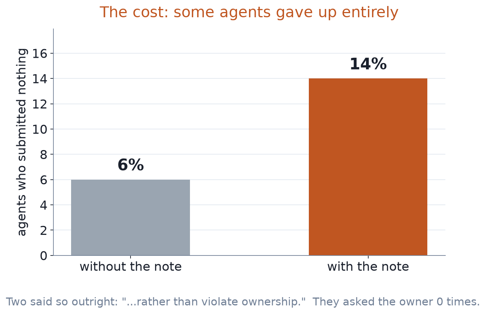

# Who owns what

### Giving AI coding agents a rule *before* they start

`gpt-5.6-luna` · `mini_swe_agent_v2` · 100 agent-runs · 20 setups · single seed

> One result, one cost, and a list of things we did **not** show.

---

## The setup

Several AI agents work on the **same codebase at the same time**.
Each one is given a different feature to build. Nobody is in charge.

They can send each other messages, but mostly they just work.
When they're all done, we **combine their edits into one codebase** and run the tests.

> Like four people editing one document at once, each in their own copy,
> barely talking — and then someone has to staple the copies together.

**The interesting question is not "can each agent code?"**
Each one usually can. The question is what happens at the stapling step.

---

## Where it breaks

If two agents changed **the same lines**, combining just fails.
Git calls this a *merge conflict*.

> Two people rewrote the same paragraph, differently.
> A computer can't tell which version is right, so it refuses to guess.

When that happens there is no combined version to test,
so the team usually scores **zero** — even though both agents did good work.

**So "the team failed" often means "the stapling failed", not "the coding failed".**
That distinction is what this whole project is about.

---

## How bad is the stapling problem?

We took the benchmark's **own official answers** — code known to be correct —
and just tried to combine them. No AI involved at all.

With 4 or more agents, the official answers collide **every single time**.

---

## Our first idea — and why we threw it away

**Idea:** predict *which pairs* of agents are heading for a collision,
and make only those two coordinate. That would be cheap, and it would scale:
you don't pay for coordination you don't need.

**What we found: there is nothing to predict.**

---

## Why that idea is dead

Every single pair of features in this benchmark edits the same file. **100%.**

That's not a flaw in our predictor — it's the shape of the benchmark.
Each task is one real code change, chopped into features, so the features
naturally live in the same place.

> A warning light that is always on is not a warning light.

**We report this as a negative result.** If you want to study *when* agents
need to coordinate, you need a benchmark where sometimes they don't.
This one can't answer that question.

---

## The reframe that saved it

Everybody collides — but ask a different question:
not *"who collides?"* (everyone) but *"what do they collide over?"*

---

## Why this is the whole idea

With 8 agents there are **28** colliding pairs but only **~3** pieces of code
being fought over.

- Talking pair-by-pair gets **quadratically** more expensive as you add agents
- Assigning an owner to each contested piece of code stays **roughly flat**

> Don't coordinate *people*. Coordinate *things*.

The number of people grows fast. The number of contested things barely moves.

*(Measured from the official answers. This is a fact about the dataset,
not yet a result about our method.)*

---

## The experiment

Before any coding starts, each agent gets a short note:

> **You own** `exif_transpose`.
> `Image.open` **belongs to agent 2** — you may use it, but don't change it.
> If you really need to change it, message the owner first.

---

## What we measured, and in what order

We decided these **before** running anything, so we couldn't pick
whichever number looked best afterwards:

1. **Did they listen?** If the note is ignored, nothing else matters
   and the experiment is void.
2. **Did they overlap less?** This is the thing the note is supposed to change.
3. **Was the effect bigger with 3 agents than with 2?**
4. **Did the final code get more correct?** We expected *little or no* change
   here, and said so in advance.

> Deciding the order in advance is the difference between a test
> and a fishing trip.

---

## Result 1 — did they listen?

Yes: contested code was left alone by non-owners **41% → 94%** of the time.

This is a sanity check, not a finding. It tells us the instruction arrived
and was followed — we also read the agents' transcripts to confirm the note
appeared verbatim.

---

## Result 2 — did they overlap less?

---

## Reading that chart honestly

The bars (left) can hide a lot. The lines (right) show **every single setup**,
so you can see it isn't one lucky case carrying the average.

- 12 setups improved, 2 got worse, 6 didn't change
- If the note did nothing, a split this lopsided happens
  about **1 time in 75** by luck alone

**The worry:** maybe agents just did *less* work, so of course they overlapped less.
**The check:** throw away every setup where any agent submitted nothing.
The effect shrinks but survives (1.14 → 0.36, 8 better vs 1 worse).

---

## Result 3 — bigger effect with more agents

This is the direction the idea predicts: the more agents, the more there is
to trip over, so the more a rule helps. Two data points is a hint, not proof.

---

## Result 4 — did the code get more correct?

Collisions dropped a lot. **Correctness did not move at all.**

---

## Why correctness didn't move

Preventing a collision and *repairing* one are different jobs.
We looked at the collisions that actually happen and asked:
could any automatic method fix this?

**Most collisions need someone to decide what the merged code should mean.**
No merge algorithm does that. Our note prevents some collisions —
it does nothing about the ones that still occur.

---

## And it cost something

Some agents read *"you don't own this"* as *"don't build your feature"*:

> *"Since `AudioBlock` is binding-owned and agent1 has completed its patch,
> I will submit without changes rather than violate ownership."*

The note told them to **ask the owner** if stuck. They asked **0 times** —
while 12–13 messages were flying around them in the same run.

---

## What we think this means

**Shown:** telling agents who owns what, before they code,
makes them respect it and overlap much less — more so with more agents.

**Not shown:** that this makes the finished code more correct.

Two different jobs, and we only touched the first:

| before coding | after coding |
|---|---|
| **prevent** overlap that didn't need to happen | **reconcile** the overlap that did |
| ← this experiment | ← still unsolved |

---

## Limits — read these before quoting anything

- **We cheated to build the rule.** We peeked at the official answers to decide
  who owns what. This is a best-case ceiling, **not a usable tool**.
- **Small.** 20 setups, one model, one benchmark, one seed.
- **Hand-picked.** Only setups where there was actually something to own.
  That excludes 1 pair in 6 (16%) — a mild restriction, but it does mean
  this is not an average over the whole benchmark.
- **The strong result is about overlap, not correctness.**
- **Two agents vs three** is a very short scaling curve.
- Nothing here says ownership "solves" multi-agent coding.

---

## What we'd do next

1. **Make asking mandatory.** An agent that needs code it doesn't own must
   request it — and must not be allowed to submit nothing.
2. **Re-run the same experiment.** That cleanly separates
   *"agents overlapped less"* from *"agents did less."*
3. **Then attack the second job:** the collisions that still happen need
   something that can decide what the merged code should mean.

> Arbitrate ownership **before** coding.
> Reconcile integration **after** coding.
> This experiment is evidence for the first half only.
