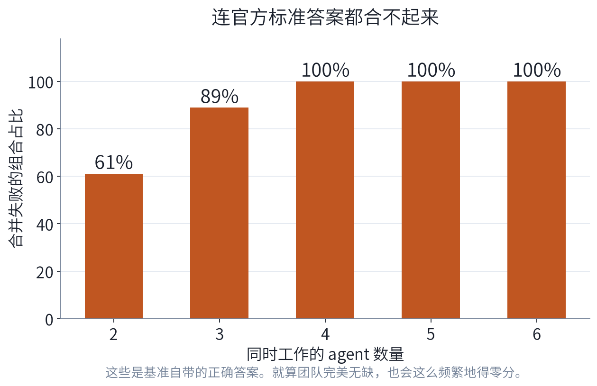
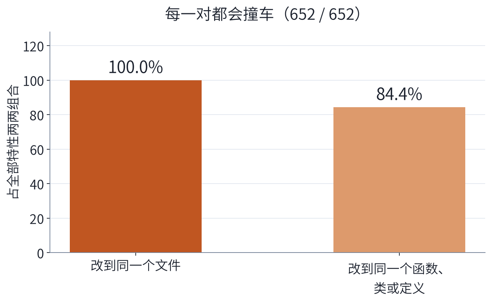
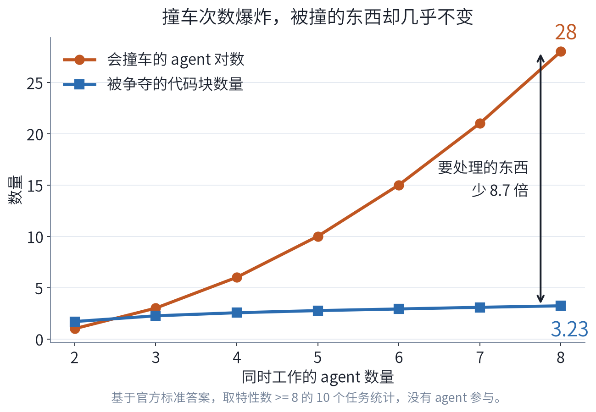
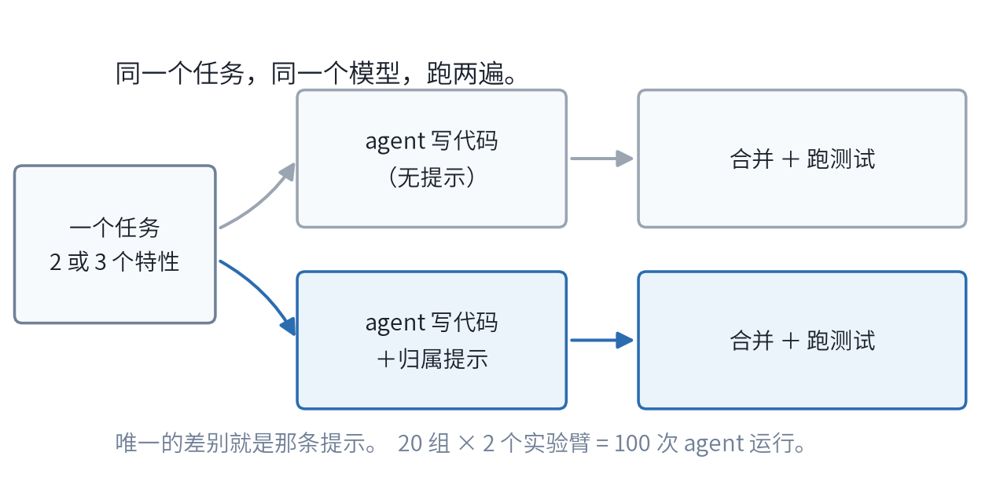
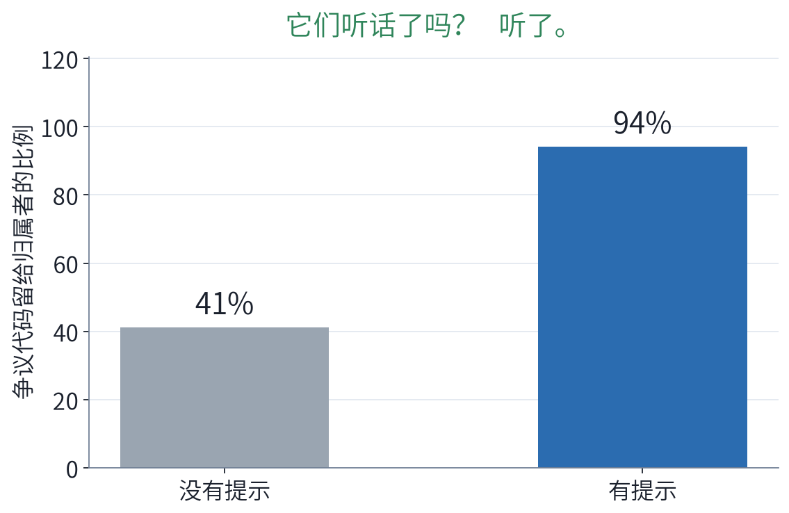
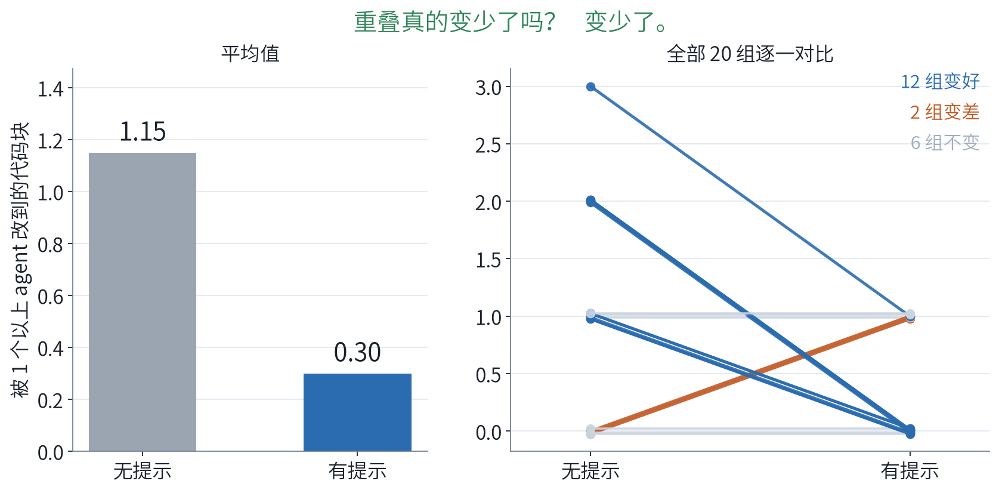
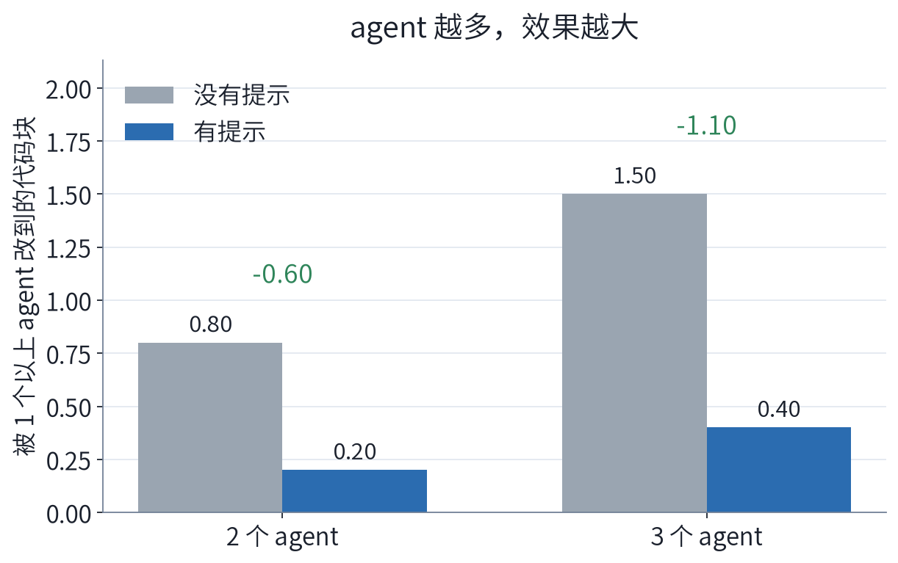
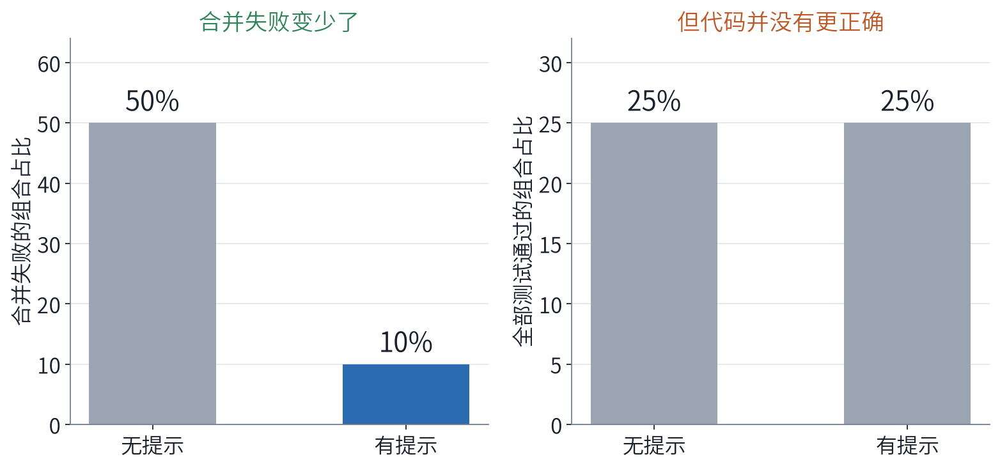
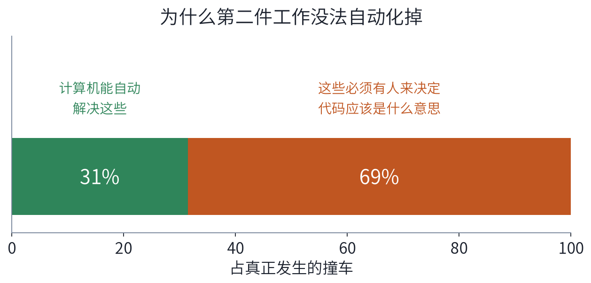
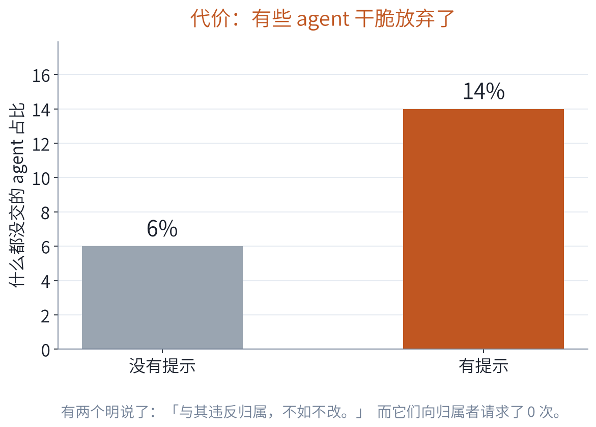

# 谁该改哪块代码

### 在 AI 开始写代码之前，先给它一条规则

`gpt-5.6-luna` · `mini_swe_agent_v2` · 100 次 agent 运行 · 20 组 · 单一随机种子

> 一个正面结果，一个代价，以及一串我们**没有**证明的东西。

---

## 场景是什么

几个 AI agent（会自己写代码的 AI 程序）**同时改同一份代码**。
每个 agent 拿到一个不同的功能去实现。没有谁当组长。

它们之间可以发消息，但大部分时间就是各写各的。
等全都写完，我们把它们的改动**合并成一份代码**，然后跑测试。

> 就像四个人同时编辑同一份文档，各自开一个副本，彼此几乎不说话——
> 最后还得有人把这些副本拼成一份。

**真正有意思的问题不是「每个 agent 会不会写代码」。**
它们大都会写。问题出在最后拼接的那一步。

---

## 卡在哪里

如果两个 agent 改了**同样的那几行**，合并就直接失败了。
Git 管这个叫**合并冲突**。

> 两个人把同一段话各自重写了一遍，写法还不一样。
> 计算机没法判断哪个才对，所以它拒绝瞎猜。

一旦这样，就没有一份合并好的代码可以拿去测试，
于是这个团队通常直接得**零分**——哪怕两个 agent 各自都干得很好。

**所以「团队失败了」往往意味着「拼接失败了」，而不是「代码写错了」。**
整个研究就是围绕这个区别展开的。

---

## 拼接这件事到底有多糟

我们直接拿基准测试**自带的官方标准答案**——已知正确的代码——
去试着合并。全程没有 AI 参与。

到了 4 个 agent 以上，官方答案之间**每一次都会撞车**。

---

## 我们最初的想法，以及为什么把它扔了

**想法：** 预测**哪两个** agent 快要撞车了，只让这两个去沟通。
这样很便宜，而且能扩展：不需要为用不上的协调付钱。

**结果：根本没有东西可以预测。**

---

## 为什么这条路是死的

这个基准里，**每一对**功能都会改到同一个文件。**100%。**

这不是我们的预测器不行，而是基准本身就长这样：
每个任务本来就是一次真实的代码改动，被切成了几个功能，
所以这些功能天然待在同一个地方。

> 一盏永远亮着的警示灯，就不是警示灯了。

**我们把这条当作负面结果如实报告。** 如果想研究 agent **什么时候**
需要协调，就得有一个「有时候不需要协调」的基准。这个基准回答不了。

---

## 换个问法，路就活了

大家都会撞车——那就换个问题问：
不问**「谁会撞车」**（所有人都会），而问**「它们在争什么」**。

---

## 这就是整个想法

8 个 agent 的时候，会撞车的组合有 **28** 对，但被争夺的代码只有 **约 3 块**。

- 一对一地沟通，随着 agent 变多，成本是**平方级**增长
- 给每块有争议的代码指定一个归属者，成本**几乎是平的**

> 不要去协调**人**，去协调**东西**。

人数涨得飞快，有争议的东西却几乎不动。

*（这是从官方答案里数出来的，是数据集的性质，还不是我们方法的成果。）*

---

## 实验怎么做

在开始写代码之前，每个 agent 会收到一条简短的提示：

> **你负责** `exif_transpose`。
> `Image.open` **属于 agent 2**——你可以调用它，但不要改它。
> 如果你实在必须改，先给归属者发消息。

---

## 我们要看哪几个指标，以及先后顺序

这几条是**跑实验之前**就定好的，这样我们就没法事后
挑一个最好看的数字来讲：

1. **它们听话了吗？** 如果提示被无视，后面什么都不用看了，实验作废。
2. **重叠变少了吗？** 这才是这条提示应该改变的东西。
3. **3 个 agent 的效果比 2 个更明显吗？**
4. **最终代码更正确了吗？** 我们**事先就预计这里几乎不会变**，并且写下来了。

> 事先定好顺序，是「做实验」和「碰运气捞数据」的区别。

---

## 结果 1 —— 它们听话了吗

听了：有争议的代码被非归属者放过的比例，从 **41% 提高到 94%**。

这只是一个健全性检查，不算发现。它说明指令确实送到了、也被执行了——
我们还翻了 agent 的对话记录，确认那条提示是逐字出现在提示词里的。

---

## 结果 2 —— 重叠真的变少了吗

---

## 怎样诚实地读这张图

左边的柱子会藏掉很多东西。右边的线画的是**每一组**，
所以你能看出来，不是某一组走运把平均值拉过去了。

- 12 组变好，2 组变差，6 组没变
- 如果这条提示毫无作用，这么一边倒的比分
  大约 **75 次里才会碰巧出现 1 次**

**一个担心：** 会不会 agent 只是**干得更少**了，所以自然就不重叠了？
**检查办法：** 把任何一边出现「什么都没交」的组全部丢掉再算。
效果变弱了，但仍然成立（1.14 → 0.36，8 组变好对 1 组变差）。

---

## 结果 3 —— agent 越多，效果越大

这正是这个想法预测的方向：agent 越多，能绊倒彼此的地方越多，
规则就越有用。不过两个数据点只是苗头，不是证明。

---

## 结果 4 —— 代码更正确了吗

撞车少了很多。**正确率一点没动。**

---

## 为什么正确率没动

**预防**一次撞车和**修好**一次撞车，是两件不同的事。
我们把真正发生的撞车拿出来问：有没有哪种自动方法能修好它？

**大部分撞车都需要有人来决定合并后的代码到底该是什么意思。**
没有任何合并算法能做这件事。我们那条提示只能预防一部分撞车，
对已经发生的那些无能为力。

---

## 而且它是有代价的

有些 agent 把**「这块不归你」**理解成了**「那就别做你的功能了」**：

> *"Since `AudioBlock` is binding-owned and agent1 has completed its patch,
> I will submit without changes rather than violate ownership."*
> （既然 `AudioBlock` 归属已定、agent1 也做完了，我宁可什么都不交，也不违反归属。）

提示里明明写了卡住就**去问归属者**。它们问了 **0 次**——
而同一次运行里，周围有 12～13 条消息在飞。

---

## 我们认为这说明了什么

**证明了：** 在写代码之前告诉 agent 谁负责哪块，
它们会遵守，而且重叠明显变少——agent 越多越明显。

**没有证明：** 这会让最终代码更正确。

两件不同的工作，我们只碰了第一件：

| 写代码之前 | 写代码之后 |
|---|---|
| **预防**那些本来就不必发生的重叠 | **调和**那些确实发生了的重叠 |
| ← 这个实验 | ← 仍然没解决 |

---

## 局限 —— 引用任何数字之前请先看这页

- **我们为了造这条规则「作弊」了。** 是偷看官方答案才决定谁负责哪块的。
  这是一个最好情况下的天花板，**不是一个能直接用的工具**。
- **规模小。** 20 组、一个模型、一个基准、一个随机种子。
- **组是挑过的。** 只挑了确实存在归属争议的组。这排除掉 6 组里的 1 组（16%），
  限制不算大，但这意味着它不是整个基准上的平均效果。
- **站得住的结论是关于「重叠」的，不是关于「正确率」的。**
- **2 个 agent 对 3 个 agent**，这条扩展性曲线非常短。
- 这里没有任何一句话说归属机制「解决了」多 agent 写代码的问题。

---

## 接下来要做什么

1. **把「请求」变成强制的。** 一个 agent 如果需要改不属于它的代码，
   必须去申请——并且不允许它什么都不交。
2. **把同一个实验再跑一遍。** 这样就能干净地分开
   *「agent 重叠变少了」*和*「agent 干得变少了」*。
3. **然后再去啃第二件工作：** 仍然会发生的那些撞车，
   需要某种能决定「合并后代码该是什么意思」的东西。

> 写代码**之前**先仲裁归属，
> 写代码**之后**再调和整合。
> 这个实验只支持前半句。
